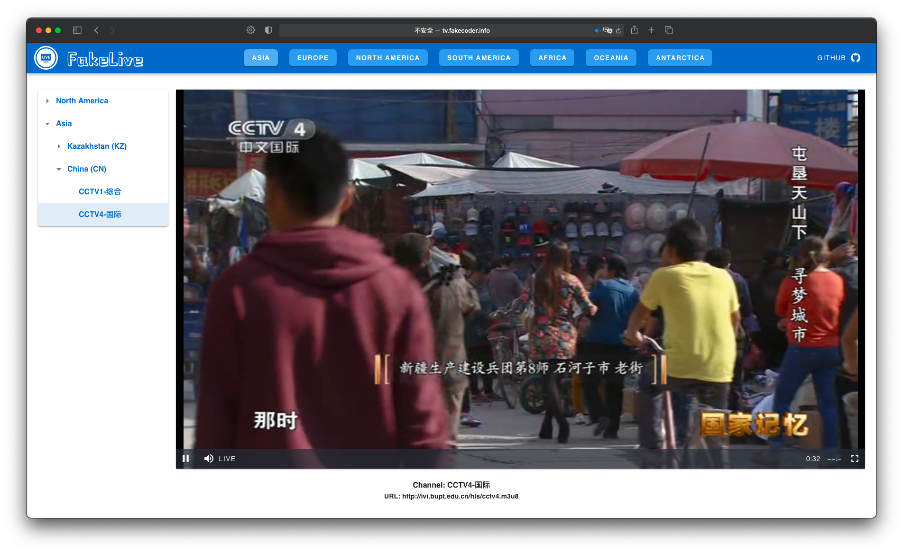

# FakeLive

Live stream tv videos all over the world.

Online demo at [tv.fakecoder.info](http://tv.fakecoder.info).

TV source urls from [simplepy](https://github.com/cnzbpy/simplepy/blob/master/CPlayer/CPlayerlist.txt).

Tech: vue + vuetify + vue-video-player.

## TODO

- [ ] vue-video-player acceleration
- [ ] live source improvement
- [ ] UE improvement

## Screenshot

